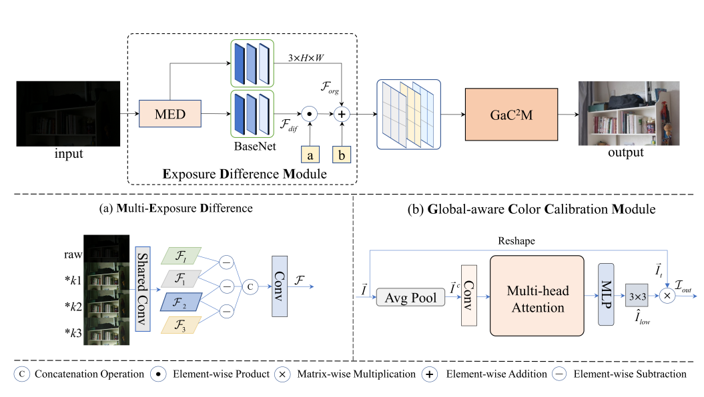

# [Pattern Recognition] Exposure Difference Network for Low-light Image Enhancement
### [Paper]() | [Code](https://github.com/Tanyjiang/ExdNet)

**Exposure Difference Network for Low-light Image Enhancement**
<br>_Shengqin Jiang, Yongyue Mei, Peng Wang, Qingshan Liu_<br>
In Pattern Recognition

## Overall



## Get Started
### Dependencies and Installation
- Python 3.10
- Pytorch 1.11.0

Clone Repo
```
git clone https://github.com/Tanyjiang/ExdNet.git
```


### Dataset
You can refer to the following links to download the datasets:
[LSRW](https://pan.baidu.com/s/1XHWQAS0ZNrnCyZ-bq7MKvA) (code: wmrr), and
[RELLISUR](https://zenodo.org/records/5234969).

### Test

1. Test the model


```bash
python test.py 

```

You can check the output in `result_img`.

### Train
1.Train the network.
```bash
python train.py 
```

## Citation
If you find our work useful for your research, please cite our paper:
```
@article{jiang2024exposure,
  title={Exposure difference network for low-light image enhancement},
  author={Jiang, Shengqin and Mei, Yongyue and Wang, Peng and Liu, Qingshan},
  journal={Pattern Recognition},
  volume={156},
  pages={110796},
  year={2024},
  publisher={Elsevier}
}
```

## Acknowledge
This project is based on IAT(https://github.com/cuiziteng/Illumination-Adaptive-Transformer). Thanks for these awesome codes!
